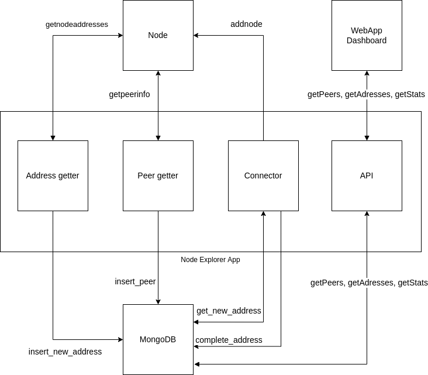
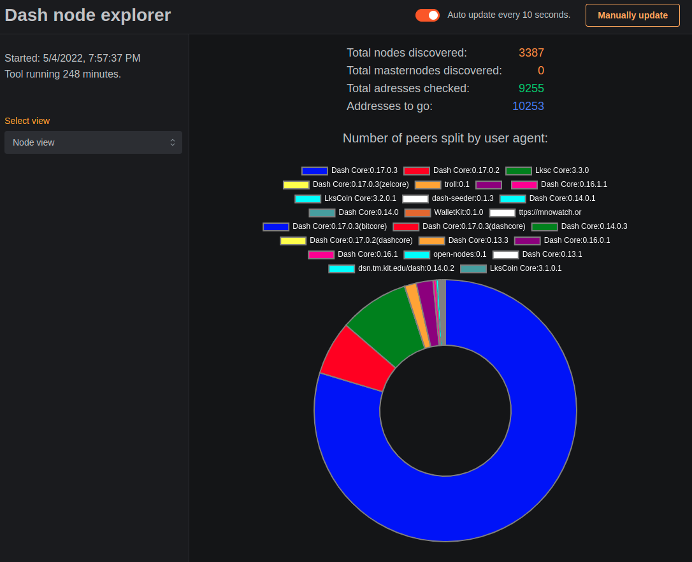
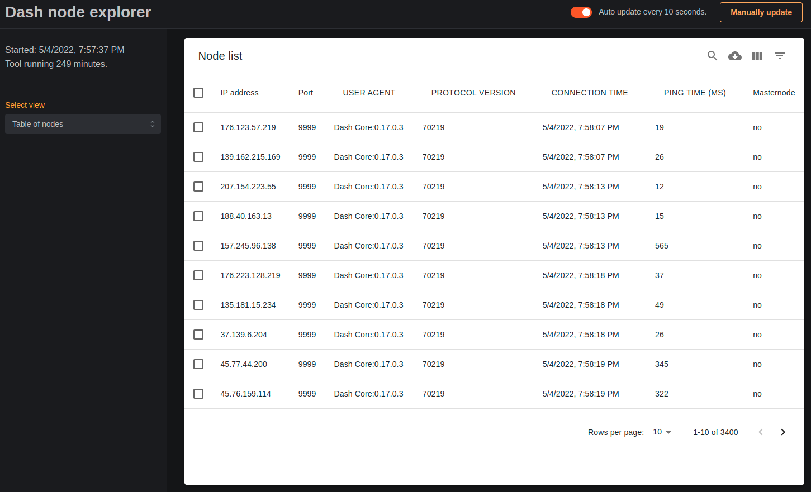

# Platforma na monitorování uzlů v P2P síti DASH

### Projekt do předmětu BDA, VUT FIT

### Bc. Daniel Pátek

\
Tento program umožňuje zmapován všech dostupných uzlů v síti dash. Získáné informace ukládá do databáze `Mongo`. Program byl napsán v jazyce `Python 3.8`. Pro webovou aplikaci byl využit framework `Next.js`.

### Instalace

**Soubory Dockerfile a docker-compose.yml nejsou zatím funkční.**

Pro spuštění programu je nutné nejprve stáhnout [`dashcore`](https://github.com/dashpay/dash/releases) ve verzi 18.0 a vyšší. Je nutné mít programy `dashd` a `dash-cli` umístěné v `$PATH`. Pro vytvoření správně umístěného `dash.conf` můžeme využít příkaz:

```bash
make install-node
```

Následně nainstalovat databázi [`mongo`](https://www.mongodb.com/try/download/community). Využívá se přístup bez autorizace, jelikož se jedná o lokálně spuštěnou aplikaci.

Očekává see naistalovaný `python3`. Pro instalaci samotného nástroje je nutné nainstalovat závislosti, ideálně následovně:

```sh
make install-python
```

Další krok očekává nainstalovaný `node` a `npm`. Pro využití webového dahboardu, který slouží k procházení nalezených klientů a pro zobrazení stavu běžícího programu, pokračujeme následovně:

```sh
make install-web
```

Kompletní instalace (všechny předchozí kroky dohromady) se spustí:

```sh
make install
```

### Spuštění nástroje

Nejprve provedeme spuštění dashcore node a samotného programu.

```sh
make run
```

Případně můžeme spustit webovou aplikaci pro dashboard.

```sh
make run-web
```

Webová aplikace bude dostupná na adrese [localhost:3000](http://localhost:3000/).

### Vypnutí běžícího uzlu v pozadí

Klient `dashcore` se defaultně spouští v pozadí. Vypnout jej můžeme využitím 

```sh
dash-cli stop
```

### Zobrazení celého systému



### Screenshoty webové aplikace



